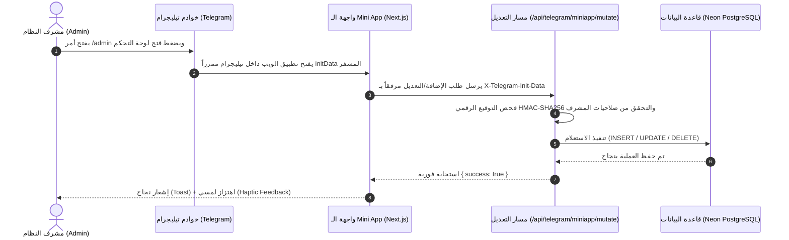

# 🗺️ خريطة وتوثيق ملفات بوت وتطبيق تيليجرام (Telegram Bot & Mini App Architecture)
### مؤسسة القوة العاشرة للمقاولات العامة والواجهات الزجاجية

تم إعداد هذا التوثيق ليكون مرجعاً هندسياً شاملاً لكل الملفات والمسارات والطبقات البرمجية المسؤولة عن تشغيل **Telegram Bot** و **Telegram Mini App**، وكيفية ترابطها مع قاعدة البيانات سحابياً (Neon PostgreSQL) ومكتبة الوسائط (Cloudflare R2).

---

## 🧭 1. الخريطة الشجرية للملفات (Directory Tree Map)

```text
webtaky/
├── src/
│   ├── app/
│   │   ├── admin/
│   │   │   └── page.tsx                         # 📱 واجهة الـ Mini App التفاعلية (Full CRUD Frontend)
│   │   └── api/
│   │       └── telegram/
│   │           ├── webhook/
│   │           │   └── route.ts                 # ⚡ نقطة استلام تحديثات تيليجرام الرئيسية (Webhook Receiver)
│   │           └── miniapp/
│   │               ├── dashboard/
│   │               │   └── route.ts             # 📊 واجهة جلب بيانات الـ Mini App (GET API)
│   │               └── mutate/
│   │                   └── route.ts             # 🛠️ واجهة تنفيذ التعديل والإضافة والحذف الحية (POST Mutation API)
│   │
│   └── lib/
│       ├── backup/                              # 📦 محرك النسخ الاحتياطي الشامل المرتبط بتيليجرام
│       │   ├── engine.ts                        # تصدير الـ 40 جدولاً والوسائط كـ .zip ورفعها للأدمن بتلجرام
│       │   ├── restore.ts                       # استعادة النسخ الاحتياطية محلياً وحقن البيانات
│       │   └── index.ts                         # واجهة استدعاء أدوات النسخ
│       │
│       └── telegram/                            # 🤖 نواة وهندسة البوت والـ Mini App
│           ├── core/                            # الطبقة التأسيسية للبوت
│           │   ├── auth.ts                      # فحص تصاريح المشرفين (telegram_admins)
│           │   ├── client.ts                    # عميل Telegram Bot API (إرسال الرسائل والصور والأزرار)
│           │   ├── keyboards.ts                 # لوحات المفاتيح والأزرار (أزرار الزوار والمشرفين و Mini App)
│           │   └── types.ts                     # تعريفات الأنواع البرمجية لتلجرام (Updates, Messages, Keyboards)
│           │
│           ├── handlers/                        # معالجات الأوامر والرسائل والضغطات التفاعلية
│           │   ├── index.ts                     # الموزع العام (Central Dispatcher & Callback Router)
│           │   ├── main.ts                      # الأوامر الأساسية (/start, /help, /menu, /stats)
│           │   ├── visitor.ts                   # معالج الزوار العاديين (قائمة الـ 3 صفوف وزر الـ Mini App)
│           │   ├── crm.ts                       # إدارة طلبات الأسعار والمواعيد والعملاء عبر الشات
│           │   ├── content.ts                   # إدارة الخدمات والمشاريع والأعمال عبر الشات
│           │   ├── reviews.ts                   # اعتماد وحذف تقييمات العملاء
│           │   ├── media.ts                     # تصفح وسائط Cloudflare R2 والتحكم بها
│           │   ├── marketing.ts                 # النشر في القنوات والحملات الإعلانية
│           │   ├── settings.ts                  # وضع الصيانة ومعلومات التواصل والمشرفين
│           │   └── system.ts                    # تشخيص النظام والذاكرة والنسخ الاحتياطي
│           │
│           ├── miniapp/                         # محرك وخدمات الـ Mini App الخلفية
│           │   ├── auth/                        # أمان وتوثيق جلسات الـ Mini App
│           │   │   ├── verify-init-data.ts      # فحص توقيع HMAC-SHA256 القادم من تيليجرام
│           │   │   ├── session.ts               # إدارة جلسة الأدمن والكوكيز المشفرة
│           │   │   └── guard.ts                 # حماية المسارات (Route Guard)
│           │   │
│           │   ├── services/                    # طبقة قراءة البيانات من قاعدة البيانات (Data Readers)
│           │   │   ├── dashboard.service.ts     # مؤشرات الأداء الحية والمشاهدات
│           │   │   ├── crm.service.ts           # جلب طلبات الأسعار مع بيانات العملاء
│           │   │   ├── services.service.ts      # جلب وتصفية الخدمات والأسعار
│           │   │   ├── projects.service.ts      # جلب المشاريع ومعرض الصور
│           │   │   ├── reviews.service.ts       # جلب التقييمات المعلقة والمعتمدة
│           │   │   ├── settings.service.ts      # جلب إعدادات المنشأة ووضع الصيانة
│           │   │   ├── media.service.ts         # جلب ملفات الوسائط
│           │   │   ├── marketing.service.ts     # جلب إحصائيات الحملات
│           │   │   └── content.service.ts       # جلب المقالات والمدونة
│           │   │
│           │   ├── actions/                     # إجراءات خادم Next.js (Server Actions)
│           │   │   ├── auth.actions.ts          # تسجيل دخول المشرف ببيانات تلجرام
│           │   │   ├── crm.actions.ts           # تعديل وحذف طلبات الأسعار
│           │   │   ├── content.actions.ts       # إضافة وتعديل الخدمات والمشاريع
│           │   │   ├── settings.actions.ts      # حفظ الإعدادات ووضع الصيانة
│           │   │   └── media.actions.ts         # رفع الوسائط السحابية
│           │   │
│           │   └── types.ts                     # واجهات وأنواع بيانات الـ Mini App
│           │
│           ├── bot.ts                           # محرك المعالجة الشاملة للبوت
│           ├── state.ts                         # ذاكرة الجلسات اللحظية (User Conversation State Machine)
│           ├── wizards.ts                       # خطوات الإدخال المتسلسل (إضافة خطوة بخطوة بالشات)
│           ├── notifications.ts                 # إرسال إشعارات فورية للأدمن عند أي طلب جديد بالموقع
│           ├── channel.ts                       # النشر التلقائي في قناة تيليجرام الرسمية
│           └── push.ts                          # تنبيهات الأحداث الفورية
│
├── scripts/                                     # 🛠️ سكريبتات الفحص والتحكم من موجه الأوامر (CLI)
│   ├── manage-webhook.ts                        # ضبط، فحص، وحذف رابط الويب هوك (get/set/delete)
│   ├── test-webhook-post.ts                     # محاكاة إرسال تحديثات تلجرام لاختبار الويب هوك
│   ├── test-bot-visitor-menu.ts                 # فحص أزرار وقائمة الزوار
│   ├── test-all-bot-commands.ts                 # فحص جميع أوامر البوت
│   └── audit-db-bot-coverage.ts                 # تدقيق تغطية الجداول الـ 40 في البوت
│
├── next.config.ts                               # 🔒 إعداد CSP frame-ancestors للسماح بالتضمين في تلجرام
├── netlify.toml                                 # 🌐 إعدادات رؤوس الأمان والتوجيه على خوادم Netlify
└── .env.local                                   # 🔑 المتغيرات السرية (Bot Token, Webhook Secret, Database URL)
```

---

## 📑 2. تفصيل وظيفة كل ملف ومسار

### 1️⃣ نقاط الدخول والخوادم (API & Webhook Entrypoints)
- **[`src/app/api/telegram/webhook/route.ts`](file:///E:/projects/webtaky/src/app/api/telegram/webhook/route.ts):**
  - يستقبل كل ما يرسله مستخدمو تيليجرام (رسائل، ضغطات أزرار، فتح روابط).
  - يتحقق من الـ `X-Telegram-Bot-Api-Secret-Token` لمنع الهجمات المجهولة.
  - يمرر التحديث إلى `handleWebhookUpdate(update)` لتنفيذه في أقل من 50 مللي ثانية.

- **[`src/app/api/telegram/miniapp/dashboard/route.ts`](file:///E:/projects/webtaky/src/app/api/telegram/miniapp/dashboard/route.ts):**
  - مسار `GET` سريع يستدعيه الـ Mini App عند الفتح.
  - يجمع إحصائيات المبيعات، الطلبات المعلقة، الخدمات، المشاريع، التقييمات، وبيانات المنشأة بالتوازي.

- **[`src/app/api/telegram/miniapp/mutate/route.ts`](file:///E:/projects/webtaky/src/app/api/telegram/miniapp/mutate/route.ts):**
  - مسار `POST` التفاعلي لتنفيذ عمليات التعديل والإضافة والحذف (Full CRUD).
  - يفحص توقيع تليجرام الرقمي المشفر `HMAC-SHA256` لضمان أن المنفّذ مشرف معتمد.
  - يدير العمليات اللحظية: تغيير حالة الطلبات، تفعيل/تعطيل الخدمات (`is_active`)، نشر التقييمات، تفعيل وضع الصيانة، وحفظ بيانات المنشأة.

---

### 2️⃣ واجهة الـ Mini App (Frontend)
- **[`src/app/admin/page.tsx`](file:///E:/projects/webtaky/src/app/admin/page.tsx):**
  - واجهة المشرف التفاعلية المتكاملة (Next.js React Client Component).
  - مصممة بنظام **Glassmorphism Dark Mode** المتوافق بنسبة 100% مع أجهزة الهواتف داخل تلجرام.
  - تحتوي على شريط تنقل سفلي مرن، ونوافذ منبثقة (Modals) لإضافة وتعديل الخدمات والمشاريع والتقييمات.
  - تدعم التفاعل اللمسي (Haptic Feedback) وإشعارات النجاح اللحظية (Toasts).

---

### 3️⃣ الطبقة التأسيسية (Core Telegram Library)
- **[`src/lib/telegram/core/client.ts`](file:///E:/projects/webtaky/src/lib/telegram/core/client.ts):**
  - المحرك المسؤول عن استدعاء Telegram Bot API (`sendMessage`, `editMessageText`, `answerCallbackQuery`, `sendDocument`).
- **[`src/lib/telegram/core/auth.ts`](file:///E:/projects/webtaky/src/lib/telegram/core/auth.ts):**
  - يفحص معرف تيليجرام للشخص ويتحقق من وجوده وصلاحياته في جدول `telegram_admins` مع دعم معرّفات الطوارئ المسجلة في `.env.local`.
- **[`src/lib/telegram/core/keyboards.ts`](file:///E:/projects/webtaky/src/lib/telegram/core/keyboards.ts):**
  - مصنع كافة الأزرار ولوحات المفاتيح:
    - `Keyboards.visitorMenu()`: قائمة الزوار المصغرة والمزودة بزر Mini App.
    - `Keyboards.adminMenu()`: قائمة الإدارة الكبرى وأزرار فتح الـ Mini App والنسخ الاحتياطي.

---

### 4️⃣ معالجات الأوامر (Handlers Layer)
- **[`src/lib/telegram/handlers/visitor.ts`](file:///E:/projects/webtaky/src/lib/telegram/handlers/visitor.ts):** استقبال الزائرين وعرض قائمة الموقع وروابط التحميل والفروع وحجز المواعيد.
- **[`src/lib/telegram/handlers/crm.ts`](file:///E:/projects/webtaky/src/lib/telegram/handlers/crm.ts):** استعراض وتحديث وحذف طلبات الأسعار المسجلة في جدول `quote_requests`.
- **[`src/lib/telegram/handlers/content.ts`](file:///E:/projects/webtaky/src/lib/telegram/handlers/content.ts):** عرض وتعديل وإدارة كتالوج الخدمات ومعرض المشاريع.
- **[`src/lib/telegram/handlers/reviews.ts`](file:///E:/projects/webtaky/src/lib/telegram/handlers/reviews.ts):** قبول ونشر التقييمات المعلقة.
- **[`src/lib/telegram/handlers/settings.ts`](file:///E:/projects/webtaky/src/lib/telegram/handlers/settings.ts):** التحكم في وضع الصيانة وبيانات التواصل وإضافة المشرفين.
- **[`src/lib/telegram/handlers/system.ts`](file:///E:/projects/webtaky/src/lib/telegram/handlers/system.ts):** فحص صحة قاعدة البيانات، حجم الجداول، وتشغيل النسخ الاحتياطي.

---

### 5️⃣ نظام النسخ الاحتياطي السحابي الفوري (Telegram Backup Vault)
- **[`src/lib/backup/engine.ts`](file:///E:/projects/webtaky/src/lib/backup/engine.ts):**
  - يسحب كافة بيانات الجداول الـ 40 بصيغتي SQL و JSON.
  - ينزّل كافة الصور والوسائط من Cloudflare R2.
  - يضغط الكل داخل ملف `.zip` ويرفعه مباشرة كمستند للأدمن داخل محادثة تيليجرام.
- **[`src/lib/backup/restore.ts`](file:///E:/projects/webtaky/src/lib/backup/restore.ts):**
  - يفك ضغط ملف النسخة الاحتياطية ويسترجع كافة الجداول والوسائط إلى الموقع وقاعدة البيانات بضغطة زر.

---

### 6️⃣ سكريبتات الإدارة والتشغيل (Scripts CLI)
- **`scripts/manage-webhook.ts`**: فحص وضبط وتحديث رابط الويب هوك:
  ```bash
  npx tsx scripts/manage-webhook.ts info
  npx tsx scripts/manage-webhook.ts set https://powerof10.netlify.app/api/telegram/webhook
  ```
- **`scripts/audit-db-bot-coverage.ts`**: فحص وتأكيد تغطية الـ 40 جدولاً في واجهات البوت.

---

## 🔄 3. دورة حياة الطلب وتدفق البيانات (Data Flow)



---

## 🔑 4. متغيرات البيئة الأساسية للبوت (`.env.local`)

| المتغير | الوصف |
|---|---|
| `TELEGRAM_BOT_TOKEN` | التوكن السري المستخرج من BotFather |
| `TELEGRAM_ADMIN_IDS` | معرّفات المشرفين المسموح لهم بالتحكم (مفصولة بفواصل) |
| `TELEGRAM_WEBHOOK_SECRET` | كلمة السر المشفرة لحماية الويب هوك من الطلبات الخارجية |
| `DATABASE_URL` | رابط الاتصال بقاعدة بيانات Neon PostgreSQL السحابية |
| `NEXT_PUBLIC_APP_URL` | الرابط الأساسي للموقع (`https://powerof10.netlify.app`) |
