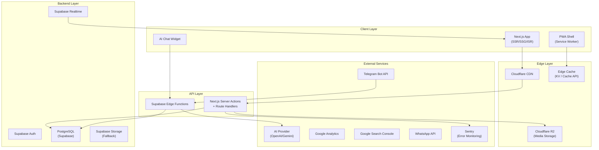

# Enterprise SEO Business Website Platform — Complete Implementation Plan

## 🎯 Project Vision

Build a **production-ready, enterprise-grade** multi-tenant business website platform optimized for local businesses (tempered glass, facades, aluminum, kitchens, contracting, etc.). The platform is **fully managed via Telegram Bot** (no web admin), powered by **AI**, **SEO-first**, **PWA-enabled**, and designed to deliver a **cinematic premium experience** rivaling Apple-level design quality.

---

## 📐 System Architecture Overview



---

## 🗄️ Database Architecture (PostgreSQL via Supabase)

### Entity Relationship Diagram

```mermaid
erDiagram
    COMPANIES ||--o{ SERVICES : offers
    COMPANIES ||--o{ CATEGORIES : has
    COMPANIES ||--o{ PROJECTS : showcases
    COMPANIES ||--o{ ARTICLES : publishes
    COMPANIES ||--o{ FAQS : has
    COMPANIES ||--o{ TESTIMONIALS : receives
    COMPANIES ||--o{ GALLERY_ALBUMS : owns
    COMPANIES ||--o{ COMPANY_CONTACTS : has
    COMPANIES ||--o{ BUSINESS_HOURS : operates
    COMPANIES ||--o{ COMPANY_ADDRESSES : located_at
    COMPANIES ||--o{ COMPANY_SETTINGS : configures
    COMPANIES ||--o{ AI_PROMPTS : configures
    COMPANIES ||--o{ PUSH_SUBSCRIPTIONS : notifies
    COMPANIES ||--o{ ANALYTICS_EVENTS : tracks
    COMPANIES ||--o{ CITY_PAGES : targets
    COMPANIES ||--o{ SEO_METADATA : optimizes

    CATEGORIES ||--o{ SERVICES : contains
    CATEGORIES ||--o{ CATEGORIES : parent_of

    SERVICES ||--o{ SERVICE_IMAGES : has
    SERVICES ||--o{ PROJECTS : features
    SERVICES ||--o{ FAQS : has
    SERVICES ||--o{ SEO_METADATA : has
    SERVICES ||--o{ CITY_SERVICES : available_in

    PROJECTS ||--o{ PROJECT_IMAGES : has
    PROJECTS ||--o{ PROJECT_VIDEOS : has
    PROJECTS ||--o{ PROJECT_BEFORE_AFTER : has

    GALLERY_ALBUMS ||--o{ GALLERY_ITEMS : contains

    ARTICLES ||--o{ ARTICLE_TAGS : tagged
    ARTICLES ||--o{ ARTICLE_IMAGES : has
    ARTICLES ||--o{ SEO_METADATA : has

    USERS ||--o{ APPOINTMENTS : books
    USERS ||--o{ MESSAGES : sends
    USERS ||--o{ CHAT_SESSIONS : initiates
    USERS ||--o{ QUOTE_REQUESTS : submits

    CHAT_SESSIONS ||--o{ CHAT_MESSAGES : contains

    CITY_PAGES ||--o{ CITY_SERVICES : links
    CITY_PAGES ||--o{ SEO_METADATA : has

    MEDIA_LIBRARY ||--o{ MEDIA_METADATA : has

    COMPANIES {
        uuid id PK
        text name_ar
        text name_en
        text slug
        text description_ar
        text description_en
        text logo_url
        text favicon_url
        text primary_color
        text secondary_color
        text accent_color
        text whatsapp_number
        text phone_primary
        text phone_secondary
        text email
        text website_url
        text google_maps_embed
        float latitude
        float longitude
        text tax_number
        text commercial_register
        boolean maintenance_mode
        text maintenance_message
        jsonb social_links
        jsonb theme_config
        text default_locale
        text[] supported_locales
        timestamp created_at
        timestamp updated_at
    }

    CATEGORIES {
        uuid id PK
        uuid company_id FK
        uuid parent_id FK
        text name_ar
        text name_en
        text slug
        text description_ar
        text description_en
        text icon
        text image_url
        int sort_order
        boolean is_active
        timestamp created_at
    }

    SERVICES {
        uuid id PK
        uuid company_id FK
        uuid category_id FK
        text name_ar
        text name_en
        text slug
        text short_description_ar
        text short_description_en
        text full_description_ar
        text full_description_en
        text cover_image_url
        text icon
        text[] features_ar
        text[] features_en
        decimal price_from
        decimal price_to
        text price_unit
        boolean show_price
        int sort_order
        boolean is_featured
        boolean is_active
        int view_count
        jsonb seo_keywords_ar
        jsonb seo_keywords_en
        timestamp created_at
        timestamp updated_at
    }

    PROJECTS {
        uuid id PK
        uuid company_id FK
        uuid service_id FK
        text title_ar
        text title_en
        text slug
        text description_ar
        text description_en
        text client_name
        text location_ar
        text location_en
        text city
        decimal project_value
        date start_date
        date end_date
        text status
        boolean is_featured
        boolean is_active
        int view_count
        jsonb specifications
        timestamp created_at
    }

    ARTICLES {
        uuid id PK
        uuid company_id FK
        uuid author_id FK
        text title_ar
        text title_en
        text slug
        text excerpt_ar
        text excerpt_en
        text content_ar
        text content_en
        text cover_image_url
        text status
        boolean is_featured
        int view_count
        int read_time_minutes
        text[] related_service_ids
        timestamp published_at
        timestamp created_at
        timestamp updated_at
    }

    TESTIMONIALS {
        uuid id PK
        uuid company_id FK
        uuid service_id FK
        text client_name
        text client_title
        text client_company
        text client_avatar_url
        text content_ar
        text content_en
        int rating
        boolean is_featured
        boolean is_approved
        text source
        timestamp created_at
    }

    FAQS {
        uuid id PK
        uuid company_id FK
        uuid service_id FK
        text question_ar
        text question_en
        text answer_ar
        text answer_en
        int sort_order
        boolean is_active
        text page_context
        timestamp created_at
    }

    MEDIA_LIBRARY {
        uuid id PK
        uuid company_id FK
        text file_name
        text original_name
        text file_url
        text cdn_url
        text thumbnail_url
        text webp_url
        text avif_url
        text blur_hash
        text mime_type
        bigint file_size
        int width
        int height
        text storage_provider
        text storage_path
        timestamp created_at
    }

    MEDIA_METADATA {
        uuid id PK
        uuid media_id FK
        text title_ar
        text title_en
        text alt_ar
        text alt_en
        text caption_ar
        text caption_en
        text description_ar
        text description_en
        text[] keywords
        text location
        text author
        text copyright
        jsonb exif_data
        timestamp created_at
    }

    SEO_METADATA {
        uuid id PK
        uuid company_id FK
        text entity_type
        uuid entity_id
        text locale
        text meta_title
        text meta_description
        text[] meta_keywords
        text canonical_url
        text og_title
        text og_description
        text og_image_url
        text og_type
        text twitter_card
        text twitter_title
        text twitter_description
        text twitter_image_url
        jsonb structured_data
        text robots
        text[] hreflang_urls
        timestamp created_at
        timestamp updated_at
    }

    CITY_PAGES {
        uuid id PK
        uuid company_id FK
        text city_name_ar
        text city_name_en
        text slug
        text description_ar
        text description_en
        text hero_image_url
        float latitude
        float longitude
        text region_ar
        text region_en
        boolean is_active
        timestamp created_at
    }

    CITY_SERVICES {
        uuid id PK
        uuid city_page_id FK
        uuid service_id FK
        text unique_content_ar
        text unique_content_en
        text[] local_keywords_ar
        text[] local_keywords_en
        timestamp created_at
    }

    USERS {
        uuid id PK
        uuid company_id FK
        text full_name
        text email
        text phone
        text whatsapp
        text city
        text source
        text utm_source
        text utm_medium
        text utm_campaign
        jsonb metadata
        timestamp created_at
    }

    APPOINTMENTS {
        uuid id PK
        uuid company_id FK
        uuid user_id FK
        uuid service_id FK
        text status
        timestamp preferred_date
        text preferred_time
        text notes
        text source
        timestamp created_at
    }

    QUOTE_REQUESTS {
        uuid id PK
        uuid company_id FK
        uuid user_id FK
        uuid service_id FK
        text description
        text budget_range
        text city
        text urgency
        jsonb ai_conversation
        text status
        text assigned_to
        timestamp created_at
    }

    MESSAGES {
        uuid id PK
        uuid company_id FK
        uuid user_id FK
        text subject
        text content
        text type
        boolean is_read
        text reply
        timestamp created_at
    }

    CHAT_SESSIONS {
        uuid id PK
        uuid company_id FK
        uuid user_id FK
        text status
        int message_count
        jsonb context
        timestamp created_at
        timestamp ended_at
    }

    CHAT_MESSAGES {
        uuid id PK
        uuid session_id FK
        text role
        text content
        text[] suggested_actions
        timestamp created_at
    }

    AI_PROMPTS {
        uuid id PK
        uuid company_id FK
        text prompt_type
        text system_prompt_ar
        text system_prompt_en
        text model
        float temperature
        int max_tokens
        jsonb context_data
        boolean is_active
        timestamp updated_at
    }

    COMPANY_SETTINGS {
        uuid id PK
        uuid company_id FK
        text key
        jsonb value
        text category
        timestamp updated_at
    }

    COMPANY_CONTACTS {
        uuid id PK
        uuid company_id FK
        text type
        text value
        text label_ar
        text label_en
        int sort_order
        boolean is_primary
        timestamp created_at
    }

    BUSINESS_HOURS {
        uuid id PK
        uuid company_id FK
        int day_of_week
        time open_time
        time close_time
        boolean is_closed
        text note_ar
        text note_en
    }

    COMPANY_ADDRESSES {
        uuid id PK
        uuid company_id FK
        text label_ar
        text label_en
        text street_ar
        text street_en
        text city_ar
        text city_en
        text region_ar
        text region_en
        text postal_code
        text country
        float latitude
        float longitude
        text google_maps_url
        boolean is_primary
    }

    PUSH_SUBSCRIPTIONS {
        uuid id PK
        uuid company_id FK
        uuid user_id FK
        text endpoint
        text p256dh
        text auth
        boolean is_active
        timestamp created_at
    }

    ANALYTICS_EVENTS {
        uuid id PK
        uuid company_id FK
        text event_type
        text page_path
        text referrer
        text utm_source
        text utm_medium
        text utm_campaign
        text device_type
        text browser
        text country
        text city
        jsonb metadata
        timestamp created_at
    }

    GALLERY_ALBUMS {
        uuid id PK
        uuid company_id FK
        text title_ar
        text title_en
        text slug
        text description_ar
        text description_en
        text cover_image_url
        int sort_order
        boolean is_active
        timestamp created_at
    }

    GALLERY_ITEMS {
        uuid id PK
        uuid album_id FK
        uuid media_id FK
        text type
        int sort_order
        timestamp created_at
    }

    PROJECT_IMAGES {
        uuid id PK
        uuid project_id FK
        uuid media_id FK
        int sort_order
        boolean is_cover
    }

    PROJECT_VIDEOS {
        uuid id PK
        uuid project_id FK
        text video_url
        text thumbnail_url
        text title_ar
        text title_en
        int duration_seconds
        int sort_order
    }

    PROJECT_BEFORE_AFTER {
        uuid id PK
        uuid project_id FK
        uuid before_image_id FK
        uuid after_image_id FK
        text caption_ar
        text caption_en
        int sort_order
    }

    SERVICE_IMAGES {
        uuid id PK
        uuid service_id FK
        uuid media_id FK
        int sort_order
        boolean is_cover
    }

    ARTICLE_IMAGES {
        uuid id PK
        uuid article_id FK
        uuid media_id FK
        text context
    }

    ARTICLE_TAGS {
        uuid id PK
        uuid article_id FK
        text tag_ar
        text tag_en
        text slug
    }

    NOTIFICATION_LOG {
        uuid id PK
        uuid company_id FK
        text type
        text title_ar
        text title_en
        text body_ar
        text body_en
        text target_audience
        int sent_count
        int delivered_count
        timestamp sent_at
    }

    AUDIT_LOG {
        uuid id PK
        uuid company_id FK
        text actor_type
        text actor_id
        text action
        text entity_type
        uuid entity_id
        jsonb old_values
        jsonb new_values
        text ip_address
        timestamp created_at
    }

    TELEGRAM_ADMINS {
        uuid id PK
        uuid company_id FK
        bigint telegram_user_id
        text telegram_username
        text role
        boolean is_active
        timestamp created_at
    }

    BACKUPS {
        uuid id PK
        uuid company_id FK
        text backup_url
        text type
        bigint size_bytes
        text status
        text triggered_by
        timestamp created_at
    }

    SEARCH_INDEX {
        uuid id PK
        uuid company_id FK
        text entity_type
        uuid entity_id
        text locale
        tsvector search_vector
        text title
        text content_preview
        text url_path
        timestamp updated_at
    }

    CUSTOMER_REVIEWS {
        uuid id PK
        uuid company_id FK
        uuid service_id FK
        uuid project_id FK
        text reviewer_name
        text reviewer_email
        text reviewer_phone
        int rating
        text title_ar
        text title_en
        text content_ar
        text content_en
        text[] image_urls
        boolean is_verified
        boolean is_approved
        text response_ar
        text response_en
        timestamp response_date
        text source
        timestamp created_at
    }
```



### Row Level Security (RLS) Strategy

| Table | Policy | Rule |
|-------|--------|------|
| All company tables | `company_isolation` | `company_id = auth.jwt() -> company_id` |
| Public content tables | `public_read` | `is_active = true` for anonymous |
| Admin tables | `admin_only` | `role IN ('admin', 'super_admin')` |
| Audit logs | `insert_only` | No UPDATE or DELETE allowed |
| User data | `self_or_admin` | `user_id = auth.uid() OR role = 'admin'` |

---

## 📁 Project Structure

```
e:\projects\webtaky\
├── .env.local
├── .env.production
├── next.config.ts
├── tailwind.config.ts
├── tsconfig.json
├── package.json
├── middleware.ts                          # i18n + security + rate limiting
├── next-sitemap.config.js
│
├── public/
│   ├── manifest.json
│   ├── sw.js                              # Service Worker
│   ├── offline.html
│   ├── robots.txt
│   ├── icons/                             # PWA icons (192, 512, maskable)
│   ├── splash/                            # Splash screens
│   ├── placeholders/                      # Offline fallback images
│   └── fonts/                             # Self-hosted fonts
│
├── src/
│   ├── app/
│   │   ├── layout.tsx                     # Root layout (fonts, theme, providers)
│   │   ├── page.tsx                       # Landing page
│   │   ├── loading.tsx                    # Global loading
│   │   ├── error.tsx                      # Global error boundary
│   │   ├── not-found.tsx                  # 404 page
│   │   ├── globals.css                    # Global styles
│   │   │
│   │   ├── [locale]/                      # i18n routing (ar/en)
│   │   │   ├── layout.tsx                 # Locale layout (dir, lang)
│   │   │   ├── page.tsx                   # Home page
│   │   │   │
│   │   │   ├── services/
│   │   │   │   ├── page.tsx               # All services
│   │   │   │   └── [slug]/
│   │   │   │       └── page.tsx           # Single service
│   │   │   │
│   │   │   ├── projects/
│   │   │   │   ├── page.tsx               # Project gallery
│   │   │   │   └── [slug]/
│   │   │   │       └── page.tsx           # Single project
│   │   │   │
│   │   │   ├── blog/
│   │   │   │   ├── page.tsx               # Blog listing
│   │   │   │   └── [slug]/
│   │   │   │       └── page.tsx           # Single article
│   │   │   │
│   │   │   ├── gallery/
│   │   │   │   ├── page.tsx               # Gallery albums
│   │   │   │   └── [slug]/
│   │   │   │       └── page.tsx           # Album detail
│   │   │   │
│   │   │   ├── about/
│   │   │   │   └── page.tsx
│   │   │   │
│   │   │   ├── contact/
│   │   │   │   └── page.tsx
│   │   │   │
│   │   │   ├── quote/
│   │   │   │   └── page.tsx               # AI-powered quote request
│   │   │   │
│   │   │   ├── faq/
│   │   │   │   └── page.tsx
│   │   │   │
│   │   │   ├── testimonials/
│   │   │   │   └── page.tsx
│   │   │   │
│   │   │   ├── search/
│   │   │   │   └── page.tsx               # Internal search
│   │   │   │
│   │   │   └── [city]/                    # City-specific pages
│   │   │       ├── page.tsx               # City landing
│   │   │       └── [service-slug]/
│   │   │           └── page.tsx           # City+Service page
│   │   │
│   │   ├── api/
│   │   │   ├── telegram/
│   │   │   │   └── webhook/
│   │   │   │       └── route.ts           # Telegram webhook handler
│   │   │   ├── chat/
│   │   │   │   └── route.ts              # AI chat streaming
│   │   │   ├── analytics/
│   │   │   │   └── route.ts              # Event tracking
│   │   │   ├── search/
│   │   │   │   └── route.ts              # Search API
│   │   │   ├── contact/
│   │   │   │   └── route.ts              # Contact form
│   │   │   ├── quote/
│   │   │   │   └── route.ts              # Quote request
│   │   │   ├── push/
│   │   │   │   ├── subscribe/
│   │   │   │   │   └── route.ts
│   │   │   │   └── send/
│   │   │   │       └── route.ts
│   │   │   ├── media/
│   │   │   │   ├── upload/
│   │   │   │   │   └── route.ts           # R2 upload with processing
│   │   │   │   └── optimize/
│   │   │   │       └── route.ts           # Image optimization
│   │   │   ├── sitemap/
│   │   │   │   └── route.ts              # Dynamic sitemap
│   │   │   ├── revalidate/
│   │   │   │   └── route.ts              # On-demand ISR
│   │   │   └── health/
│   │   │       └── route.ts
│   │   │
│   │   └── sitemap.ts                     # Next.js sitemap
│   │
│   ├── components/
│   │   ├── ui/                            # Atomic design system
│   │   │   ├── Button.tsx
│   │   │   ├── Input.tsx
│   │   │   ├── Badge.tsx
│   │   │   ├── Card.tsx
│   │   │   ├── Modal.tsx
│   │   │   ├── Skeleton.tsx
│   │   │   ├── Accordion.tsx
│   │   │   ├── Carousel.tsx
│   │   │   ├── Tabs.tsx
│   │   │   ├── Toast.tsx
│   │   │   ├── Tooltip.tsx
│   │   │   ├── ProgressBar.tsx
│   │   │   ├── RatingStars.tsx
│   │   │   └── index.ts
│   │   │
│   │   ├── layout/
│   │   │   ├── Header.tsx                 # Responsive header with mega menu
│   │   │   ├── Footer.tsx                 # Premium footer
│   │   │   ├── MobileNav.tsx              # Bottom navigation
│   │   │   ├── Breadcrumbs.tsx            # SEO breadcrumbs
│   │   │   ├── LanguageSwitcher.tsx
│   │   │   ├── ThemeToggle.tsx
│   │   │   └── ScrollToTop.tsx
│   │   │
│   │   ├── sections/
│   │   │   ├── HeroSection.tsx            # Cinematic hero
│   │   │   ├── ServicesShowcase.tsx        # Interactive services grid
│   │   │   ├── ProjectGallery.tsx         # Filterable gallery
│   │   │   ├── BeforeAfterSlider.tsx      # Comparison slider
│   │   │   ├── TestimonialsCarousel.tsx   # Client reviews
│   │   │   ├── AnimatedStats.tsx          # Counting statistics
│   │   │   ├── InteractiveTimeline.tsx    # Company timeline
│   │   │   ├── BusinessProcess.tsx        # How we work
│   │   │   ├── FaqAccordion.tsx           # FAQ with schema
│   │   │   ├── QuoteRequestSection.tsx    # AI-guided quote
│   │   │   ├── GoogleMapsSection.tsx      # Interactive map
│   │   │   ├── BlogPreview.tsx            # Latest articles
│   │   │   ├── CityServicesGrid.tsx       # City coverage
│   │   │   ├── ClientLogos.tsx            # Trust badges
│   │   │   └── CTASection.tsx             # Call to action
│   │   │
│   │   ├── features/
│   │   │   ├── chat/
│   │   │   │   ├── ChatWidget.tsx         # Floating chat button
│   │   │   │   ├── ChatWindow.tsx         # Chat interface
│   │   │   │   ├── ChatMessage.tsx        # Message bubble
│   │   │   │   ├── ChatInput.tsx          # Input with suggestions
│   │   │   │   ├── TypingIndicator.tsx
│   │   │   │   └── SuggestedActions.tsx
│   │   │   │
│   │   │   ├── media/
│   │   │   │   ├── OptimizedImage.tsx     # R2 image with fallback
│   │   │   │   ├── VideoPlayer.tsx        # Lazy video player
│   │   │   │   ├── ImageLightbox.tsx      # Gallery lightbox
│   │   │   │   ├── BlurPlaceholder.tsx
│   │   │   │   └── MediaGallery.tsx
│   │   │   │
│   │   │   ├── forms/
│   │   │   │   ├── ContactForm.tsx
│   │   │   │   ├── QuoteWizard.tsx        # Multi-step AI quote
│   │   │   │   ├── AppointmentForm.tsx
│   │   │   │   ├── ReviewForm.tsx
│   │   │   │   └── NewsletterForm.tsx
│   │   │   │
│   │   │   ├── search/
│   │   │   │   ├── SearchDialog.tsx       # Full-text search modal
│   │   │   │   ├── SearchResults.tsx
│   │   │   │   └── SearchHighlight.tsx
│   │   │   │
│   │   │   └── pwa/
│   │   │       ├── InstallPrompt.tsx      # PWA install banner
│   │   │       ├── OfflineBanner.tsx
│   │   │       └── PushPermission.tsx
│   │   │
│   │   ├── marketing/
│   │   │   ├── WhatsAppButton.tsx         # Floating WhatsApp
│   │   │   ├── ClickToCall.tsx
│   │   │   ├── CookieConsent.tsx
│   │   │   └── SocialProof.tsx
│   │   │
│   │   └── seo/
│   │       ├── JsonLd.tsx                 # Structured data renderer
│   │       ├── MetaTags.tsx               # OG + Twitter cards
│   │       ├── HreflangTags.tsx           # Multi-language tags
│   │       └── BreadcrumbSchema.tsx
│   │
│   ├── lib/
│   │   ├── supabase/
│   │   │   ├── client.ts                  # Browser client
│   │   │   ├── server.ts                  # Server client
│   │   │   ├── admin.ts                   # Service role client
│   │   │   ├── middleware.ts              # Auth middleware
│   │   │   └── types.ts                   # Generated types
│   │   │
│   │   ├── cloudflare/
│   │   │   ├── r2.ts                      # R2 upload/download/signed URLs
│   │   │   ├── cache.ts                   # Edge caching utilities
│   │   │   └── image-transform.ts         # WebP/AVIF generation
│   │   │
│   │   ├── telegram/
│   │   │   ├── bot.ts                     # Bot instance & handlers
│   │   │   ├── menus.ts                   # Interactive menu system
│   │   │   ├── handlers/
│   │   │   │   ├── company.ts             # Company info management
│   │   │   │   ├── services.ts            # Service CRUD
│   │   │   │   ├── categories.ts          # Category CRUD
│   │   │   │   ├── projects.ts            # Project CRUD
│   │   │   │   ├── gallery.ts             # Gallery management
│   │   │   │   ├── articles.ts            # Blog/article CRUD
│   │   │   │   ├── media.ts               # Media upload/manage
│   │   │   │   ├── seo.ts                 # SEO metadata editor
│   │   │   │   ├── faqs.ts                # FAQ CRUD
│   │   │   │   ├── testimonials.ts        # Testimonial management
│   │   │   │   ├── cities.ts              # City pages management
│   │   │   │   ├── settings.ts            # App settings
│   │   │   │   ├── analytics.ts           # View analytics
│   │   │   │   ├── ai-config.ts           # AI prompt configuration
│   │   │   │   ├── push.ts                # Push notification broadcast
│   │   │   │   ├── backup.ts              # Backup/restore
│   │   │   │   ├── cache.ts               # Cache management
│   │   │   │   ├── maintenance.ts         # Maintenance mode
│   │   │   │   ├── users.ts               # User management
│   │   │   │   ├── reviews.ts             # Review management
│   │   │   │   ├── appointments.ts        # Appointment management
│   │   │   │   ├── messages.ts            # Messages management
│   │   │   │   └── article-generator.ts   # AI article generation
│   │   │   ├── keyboards.ts              # Inline keyboard layouts
│   │   │   └── middleware.ts              # Auth + rate limit
│   │   │
│   │   ├── ai/
│   │   │   ├── chat.ts                    # AI chat engine
│   │   │   ├── seo-generator.ts           # SEO content generation
│   │   │   ├── article-generator.ts       # AI blog articles
│   │   │   ├── quote-assistant.ts         # Quote guidance AI
│   │   │   └── prompts.ts                # Prompt templates
│   │   │
│   │   ├── seo/
│   │   │   ├── structured-data.ts         # JSON-LD generators
│   │   │   ├── sitemap.ts                 # Dynamic sitemap
│   │   │   ├── metadata.ts               # Meta tag generator
│   │   │   └── slug.ts                    # Slug utilities
│   │   │
│   │   ├── analytics/
│   │   │   ├── tracker.ts                 # Event tracking
│   │   │   ├── google.ts                  # GA4 integration
│   │   │   ├── pixels.ts                  # FB/TikTok/Snap pixels
│   │   │   └── utm.ts                     # UTM parser
│   │   │
│   │   ├── security/
│   │   │   ├── csp.ts                     # CSP headers
│   │   │   ├── rate-limit.ts              # Rate limiting
│   │   │   ├── csrf.ts                    # CSRF protection
│   │   │   ├── sanitize.ts               # Input sanitization
│   │   │   └── headers.ts                # Security headers
│   │   │
│   │   ├── pwa/
│   │   │   ├── register.ts               # SW registration
│   │   │   ├── push.ts                    # Push notification utils
│   │   │   └── offline.ts                # Offline strategies
│   │   │
│   │   ├── i18n/
│   │   │   ├── config.ts                 # i18n configuration
│   │   │   ├── dictionaries/
│   │   │   │   ├── ar.json               # Arabic translations
│   │   │   │   └── en.json               # English translations
│   │   │   ├── get-dictionary.ts         # Server-side dictionary
│   │   │   └── use-dictionary.ts         # Client-side hook
│   │   │
│   │   ├── cache/
│   │   │   ├── strategy.ts               # Caching strategies
│   │   │   ├── revalidate.ts             # ISR revalidation
│   │   │   └── tags.ts                    # Cache tags
│   │   │
│   │   └── utils/
│   │       ├── cn.ts                      # classnames utility
│   │       ├── format.ts                 # Date/number formatting
│   │       ├── validation.ts             # Zod schemas
│   │       └── errors.ts                 # Error handling
│   │
│   ├── hooks/
│   │   ├── useMediaQuery.ts
│   │   ├── useIntersection.ts
│   │   ├── useTheme.ts
│   │   ├── useLocale.ts
│   │   ├── useOnline.ts
│   │   ├── useScrollDirection.ts
│   │   └── usePWAInstall.ts
│   │
│   ├── styles/
│   │   ├── theme.ts                       # Theme tokens
│   │   ├── animations.css                # CSS animations
│   │   └── typography.css                # Font system
│   │
│   └── types/
│       ├── database.ts                   # Supabase generated types
│       ├── api.ts                        # API response types
│       ├── telegram.ts                   # Telegram types
│       └── global.d.ts                   # Global declarations
│
├── supabase/
│   ├── config.toml
│   ├── migrations/
│   │   ├── 001_initial_schema.sql
│   │   ├── 002_rls_policies.sql
│   │   ├── 003_functions.sql
│   │   ├── 004_triggers.sql
│   │   ├── 005_indexes.sql
│   │   ├── 006_search_index.sql
│   │   └── 007_seed_data.sql
│   │
│   └── functions/
│       ├── telegram-webhook/
│       │   └── index.ts
│       ├── ai-chat/
│       │   └── index.ts
│       ├── image-process/
│       │   └── index.ts
│       ├── seo-generate/
│       │   └── index.ts
│       ├── backup/
│       │   └── index.ts
│       └── push-notify/
│           └── index.ts
│
├── scripts/
│   ├── setup-supabase.ts                  # Database setup script
│   ├── generate-types.ts                  # Type generation
│   ├── seed-demo.ts                       # Demo data seeder
│   └── create-r2-bucket.ts               # R2 bucket setup
│
└── tests/
    ├── e2e/
    │   ├── home.spec.ts
    │   ├── services.spec.ts
    │   ├── seo.spec.ts
    │   └── pwa.spec.ts
    │
    └── unit/
        ├── seo.test.ts
        ├── telegram.test.ts
        └── ai.test.ts
```

---

## 🗓️ Detailed Implementation Timeline

> **Total Estimated Duration: 14 Sprints (7 Weeks)**
> Each sprint = 2-3 days of focused implementation

---

### 🔷 PHASE 1 — Foundation & Infrastructure (Week 1)

---

#### Sprint 1: Project Bootstrap & Core Infrastructure (Days 1-2)

| # | Task | Details | Est. Hours |
|---|------|---------|-----------|
| 1.1 | Initialize Next.js project | `npx create-next-app@latest` with TypeScript, Tailwind, App Router, ESLint | 1h |
| 1.2 | Configure TypeScript | Strict mode, path aliases, module resolution | 0.5h |
| 1.3 | Configure Tailwind CSS | Custom theme tokens, dark mode, Arabic typography, RTL support, custom colors, animations | 2h |
| 1.4 | Setup project structure | Create all directories, index files, barrel exports | 1h |
| 1.5 | Configure ESLint + Prettier | Enterprise linting rules, import sorting, accessibility plugin | 1h |
| 1.6 | Environment configuration | `.env.local`, `.env.production`, validation with Zod | 1h |
| 1.7 | Install core dependencies | Framer Motion, Supabase client, sharp, web-push, zod, etc. | 0.5h |
| 1.8 | Configure `next.config.ts` | Images, headers, redirects, i18n, security headers, R2 domains | 1.5h |
| 1.9 | Setup middleware.ts | i18n routing, security headers, rate limiting skeleton | 2h |
| 1.10 | Configure fonts | Self-host Arabic (Tajawal/Cairo) + English (Inter) via `next/font` | 1h |
| **Total** | | | **11.5h** |

**Deliverables:**
- ✅ Running Next.js app with complete folder structure
- ✅ Tailwind configured with RTL support and dark mode
- ✅ Strict TypeScript configuration
- ✅ Environment variables validated
- ✅ Middleware with i18n routing

---

#### Sprint 2: Database Schema & Supabase Setup (Days 3-4)

| # | Task | Details | Est. Hours |
|---|------|---------|-----------|
| 2.1 | Design complete PostgreSQL schema | All 35+ tables with proper relations, constraints, indexes | 4h |
| 2.2 | Write migration: `001_initial_schema.sql` | CREATE TABLE statements with proper types, constraints, defaults | 3h |
| 2.3 | Write migration: `002_rls_policies.sql` | Row Level Security for all tables | 2h |
| 2.4 | Write migration: `003_functions.sql` | Database functions: slug generation, search indexing, analytics aggregation | 2h |
| 2.5 | Write migration: `004_triggers.sql` | Auto-update timestamps, search vectors, view counters | 1.5h |
| 2.6 | Write migration: `005_indexes.sql` | B-tree, GIN (full-text), GiST (geo) indexes | 1h |
| 2.7 | Write migration: `006_search_index.sql` | tsvector configuration for Arabic + English full-text search | 1.5h |
| 2.8 | Write seed data script | `007_seed_data.sql` with realistic demo data | 2h |
| 2.9 | Generate TypeScript types | Supabase type generation script | 0.5h |
| 2.10 | Setup Supabase clients | Server, client, admin, middleware clients | 1h |
| **Total** | | | **18.5h** |

**Deliverables:**
- ✅ Complete normalized PostgreSQL schema with 35+ tables
- ✅ All migrations ready to run
- ✅ Row Level Security policies
- ✅ Full-text search in Arabic + English
- ✅ TypeScript database types generated
- ✅ Supabase clients configured

---

#### Sprint 3: Cloudflare R2 & Media Pipeline (Day 5)

| # | Task | Details | Est. Hours |
|---|------|---------|-----------|
| 3.1 | Configure Cloudflare R2 | Bucket setup, CORS, public access, custom domain | 1.5h |
| 3.2 | Build R2 upload service | Signed URL generation, multipart upload, file validation | 2h |
| 3.3 | Build image processing pipeline | WebP/AVIF generation, resize, blur hash, thumbnail | 3h |
| 3.4 | Build media library service | CRUD operations, metadata extraction, EXIF parsing | 2h |
| 3.5 | Build `OptimizedImage` component | R2 integration, responsive srcSet, fallback, blur placeholder, lazy load | 2h |
| 3.6 | Build `VideoPlayer` component | Lazy loading, streaming optimization, poster image | 1.5h |
| 3.7 | Build offline media fallbacks | Placeholder images, skeleton loaders, error recovery | 1h |
| 3.8 | Image sitemap generator | Dynamic image sitemap from media library | 1h |
| **Total** | | | **14h** |

**Deliverables:**
- ✅ R2 bucket configured with signed URLs
- ✅ Automatic WebP + AVIF generation
- ✅ Blur hash placeholder system
- ✅ Responsive image component with fallbacks
- ✅ Media library with full metadata support

---

### 🔷 PHASE 2 — Design System & Core Components (Week 2)

---

#### Sprint 4: Design System & UI Components (Days 6-7)

| # | Task | Details | Est. Hours |
|---|------|---------|-----------|
| 4.1 | Design color system | Premium palette, dark/light themes, semantic colors, glassmorphism tokens | 2h |
| 4.2 | Typography system | Arabic + English font scales, responsive sizes, line heights | 1.5h |
| 4.3 | Build `Button` component | Variants (primary, secondary, ghost, outline), sizes, loading states, icons | 1.5h |
| 4.4 | Build `Input` component | Text, textarea, select, with validation, RTL support, floating labels | 1.5h |
| 4.5 | Build `Card` component | Variants, hover effects, glassmorphism, 3D transforms | 1h |
| 4.6 | Build `Modal` component | Portal, focus trap, animations, accessibility | 1.5h |
| 4.7 | Build `Skeleton` component | Content, image, card, text skeletons with shimmer | 1h |
| 4.8 | Build `Accordion` component | Animated, accessible, icon support | 1h |
| 4.9 | Build `Carousel` component | Touch, swipe, autoplay, indicators, accessibility | 2h |
| 4.10 | Build `Toast` component | Notifications with animations | 1h |
| 4.11 | Build `Badge`, `Tooltip`, `Tabs`, `ProgressBar`, `RatingStars` | Complete UI kit | 2h |
| 4.12 | CSS animations library | Fade, slide, scale, float, reveal animations | 1.5h |
| **Total** | | | **17.5h** |

**Deliverables:**
- ✅ Complete design system with dark/light themes
- ✅ 15+ reusable UI components
- ✅ RTL-first responsive design
- ✅ Animation library
- ✅ Accessibility-first component architecture

---

#### Sprint 5: Layout Components & Navigation (Days 8-9)

| # | Task | Details | Est. Hours |
|---|------|---------|-----------|
| 5.1 | Build `Header` component | Sticky, transparent-to-solid, mega menu, language switcher, search trigger, mobile menu | 3h |
| 5.2 | Build `Footer` component | Premium layout, multi-column, newsletter, social links, SEO links | 2h |
| 5.3 | Build `MobileNav` component | Bottom navigation bar, safe areas, haptic feedback | 2h |
| 5.4 | Build `Breadcrumbs` component | Auto-generation, JSON-LD breadcrumb schema | 1.5h |
| 5.5 | Build `LanguageSwitcher` | Arabic/English toggle with flag icons, URL preservation | 1h |
| 5.6 | Build `ThemeToggle` | Dark/light with system preference, persistence | 1h |
| 5.7 | Build `ScrollToTop` | Smooth scroll, visibility threshold | 0.5h |
| 5.8 | Build root layout | Providers, fonts, theme, meta, PWA manifest link | 1.5h |
| 5.9 | Build locale layout | RTL/LTR, dir attribute, language-specific styles | 1h |
| 5.10 | Build global loading & error pages | Premium loading animation, user-friendly error page | 1.5h |
| 5.11 | Build 404 page | Premium design with suggestions and search | 1h |
| **Total** | | | **16h** |

**Deliverables:**
- ✅ Responsive header with mega menu
- ✅ Premium footer with SEO links
- ✅ Mobile bottom navigation
- ✅ Breadcrumb system with schema
- ✅ i18n switching (AR/EN)
- ✅ Theme system (dark/light)

---

### 🔷 PHASE 3 — Landing Page & Premium Sections (Week 3)

---

#### Sprint 6: Cinematic Hero & Premium Landing Sections (Days 10-11)

| # | Task | Details | Est. Hours |
|---|------|---------|-----------|
| 6.1 | Build `HeroSection` | Full-screen cinematic hero: animated gradient background, glassmorphism overlay, depth effects, floating particles, premium typography, CTA buttons, WhatsApp entry, AI chat entry | 4h |
| 6.2 | Build `ServicesShowcase` | Interactive grid/carousel with 3D card hover effects, category filtering, icons, reveal-on-scroll | 3h |
| 6.3 | Build `AnimatedStats` | Counting numbers with intersection observer trigger, icons, descriptions | 1.5h |
| 6.4 | Build `BusinessProcess` | Interactive step-by-step "How We Work" section with timeline/flow design | 2h |
| 6.5 | Build `InteractiveTimeline` | Horizontal/vertical scrollable company history timeline | 2h |
| 6.6 | Build `ClientLogos` | Auto-scrolling trust badges/partner logos | 1h |
| 6.7 | Build `CTASection` | Premium call-to-action with background effects | 1.5h |
| 6.8 | Motion design integration | Scroll-triggered animations, parallax, GPU-accelerated transitions for all sections | 2h |
| **Total** | | | **17h** |

**Deliverables:**
- ✅ Cinematic hero section with animations
- ✅ Interactive services showcase
- ✅ Animated statistics counter
- ✅ Business process flow section
- ✅ Company timeline
- ✅ All sections with premium scroll animations

---

#### Sprint 7: Gallery, Testimonials & Interactive Sections (Days 12-13)

| # | Task | Details | Est. Hours |
|---|------|---------|-----------|
| 7.1 | Build `ProjectGallery` | Masonry grid, category filter, lightbox, lazy loading, skeleton loading | 3h |
| 7.2 | Build `BeforeAfterSlider` | Touch-friendly comparison slider with drag handle | 2h |
| 7.3 | Build `TestimonialsCarousel` | Premium carousel with rating stars, avatars, review schema | 2h |
| 7.4 | Build `ImageLightbox` | Full-screen gallery viewer with zoom, swipe, keyboard nav | 2h |
| 7.5 | Build `BlogPreview` | Latest articles grid with hover effects, read time, categories | 1.5h |
| 7.6 | Build `GoogleMapsSection` | Lazy-loaded embedded map with custom styling | 1.5h |
| 7.7 | Build `CityServicesGrid` | Grid showing service coverage by city with links | 1.5h |
| 7.8 | Build `FaqAccordion` | Animated accordion with FAQ schema markup | 1.5h |
| 7.9 | Assemble complete landing page | Compose all sections into Home page with proper ordering, spacing, transitions | 2h |
| **Total** | | | **17h** |

**Deliverables:**
- ✅ Interactive project gallery with lightbox
- ✅ Before/after comparison slider
- ✅ Testimonials carousel
- ✅ FAQ accordion with structured data
- ✅ Complete assembled landing page

---

### 🔷 PHASE 4 — Content Pages & SEO (Week 4)

---

#### Sprint 8: Content Pages (Days 14-15)

| # | Task | Details | Est. Hours |
|---|------|---------|-----------|
| 8.1 | Build Services listing page | Grid with filtering, sorting, pagination, SEO | 2h |
| 8.2 | Build Single Service page | Full details, gallery, related projects, FAQ, CTA, schema | 3h |
| 8.3 | Build Projects listing page | Filterable gallery, categories, search | 2h |
| 8.4 | Build Single Project page | Full gallery, before/after, specs, related services, schema | 3h |
| 8.5 | Build Blog listing page | Grid, categories, tags, search, pagination | 2h |
| 8.6 | Build Single Article page | Rich content, TOC, related articles, share buttons, schema | 3h |
| 8.7 | Build About page | Company story, team, timeline, values, awards | 2h |
| 8.8 | Build Gallery page | Album-based gallery with lightbox | 2h |
| 8.9 | Build Testimonials page | All reviews with filtering, rating display | 1.5h |
| 8.10 | Build FAQ page | Categorized FAQ with search | 1.5h |
| **Total** | | | **22h** |

**Deliverables:**
- ✅ All content pages fully built with SSR/SSG/ISR
- ✅ Each page optimized for SEO with proper schema
- ✅ Responsive design across all breakpoints
- ✅ Loading states and error handling

---

#### Sprint 9: SEO Engine & Structured Data (Days 16-17)

| # | Task | Details | Est. Hours |
|---|------|---------|-----------|
| 9.1 | Build JSON-LD generators | Organization, LocalBusiness, Service, Article, FAQ, Review, Breadcrumb, Product schemas | 3h |
| 9.2 | Build metadata generator | Dynamic meta titles, descriptions, keywords from DB content | 2h |
| 9.3 | Build sitemap system | Dynamic XML sitemap with services, projects, articles, cities, images, videos | 2h |
| 9.4 | Build `robots.txt` | Dynamic robots.txt with sitemap reference | 0.5h |
| 9.5 | Build hreflang system | Automatic hreflang tags for AR/EN pages | 1.5h |
| 9.6 | Build canonical URL system | Automatic canonical URLs for all pages | 1h |
| 9.7 | Build Open Graph system | Dynamic OG images, titles, descriptions | 1.5h |
| 9.8 | Build Twitter Cards | Card metadata for all page types | 0.5h |
| 9.9 | Build city-service pages | Dynamic `[city]/[service-slug]` pages with unique content, local keywords, local schema | 3h |
| 9.10 | Build internal linking engine | Automatic related services, articles, cross-linking | 1.5h |
| 9.11 | Heading hierarchy audit | Ensure perfect H1→H6 hierarchy on every page | 1h |
| 9.12 | Semantic HTML audit | Proper use of `<main>`, `<article>`, `<section>`, `<nav>`, `<aside>` | 1h |
| **Total** | | | **19h** |

**Deliverables:**
- ✅ 8+ JSON-LD schema types implemented
- ✅ Automatic sitemap generation (pages, images, videos)
- ✅ hreflang for multi-language SEO
- ✅ City+Service dynamic pages for local SEO
- ✅ Complete OG + Twitter Cards
- ✅ Semantic HTML throughout

---

### 🔷 PHASE 5 — Interactive Features (Week 5)

---

#### Sprint 10: AI Chat System & Quote Wizard (Days 18-19)

| # | Task | Details | Est. Hours |
|---|------|---------|-----------|
| 10.1 | Build AI chat engine | Streaming responses, system prompt from DB, context management, conversation history | 3h |
| 10.2 | Build `ChatWidget` | Floating button with notification badge, open/close animation | 1.5h |
| 10.3 | Build `ChatWindow` | Full chat interface with message list, typing indicator, streaming text | 3h |
| 10.4 | Build `ChatMessage` | Message bubbles, markdown rendering, action buttons | 1.5h |
| 10.5 | Build `SuggestedActions` | Quick reply buttons, WhatsApp handoff, appointment booking | 1h |
| 10.6 | Build AI Quote Wizard | Multi-step form with AI guidance, contextual questions, service detection | 3h |
| 10.7 | Build `QuoteRequestSection` | AI-powered quote page with smart form | 2h |
| 10.8 | Build `ContactForm` | Validated contact form with spam protection | 1.5h |
| 10.9 | Build `AppointmentForm` | Date/time picker, service selection, confirmation | 2h |
| 10.10 | Build `ReviewForm` | Star rating, text review, image upload | 1.5h |
| 10.11 | Build chat API route | Streaming response handler, rate limiting, context injection | 2h |
| **Total** | | | **22h** |

**Deliverables:**
- ✅ Fully functional AI chatbot with streaming
- ✅ Configurable system prompt from Supabase
- ✅ AI-powered quote wizard
- ✅ All forms with validation and spam protection
- ✅ WhatsApp handoff from chat

---

#### Sprint 11: Search, Analytics & Marketing (Days 20-21)

| # | Task | Details | Est. Hours |
|---|------|---------|-----------|
| 11.1 | Build internal search system | Full-text search using PostgreSQL tsvector, Arabic morphology | 2h |
| 11.2 | Build `SearchDialog` | Command palette style search (Cmd+K), results with highlights | 2h |
| 11.3 | Build search API route | Debounced API with ranking, suggestions | 1.5h |
| 11.4 | Build analytics tracker | Custom event tracking, page views, service views, CTA clicks | 2h |
| 11.5 | Build analytics API | Event ingestion, aggregation queries | 1.5h |
| 11.6 | Integrate Google Analytics 4 | GA4 with consent, events, conversions | 1h |
| 11.7 | Build pixel integration | Facebook, TikTok, Snapchat pixel stubs, Meta Conversion API ready | 1.5h |
| 11.8 | Build UTM tracking | Parse and store UTM parameters, attribute conversions | 1h |
| 11.9 | Build `WhatsAppButton` | Floating button with pre-filled message, analytics tracking | 1h |
| 11.10 | Build `ClickToCall` | Click-to-call with phone number formatting | 0.5h |
| 11.11 | Build `CookieConsent` | GDPR-ready consent banner with granular control | 1.5h |
| 11.12 | Build `SocialProof` | Real-time visitor count, recent actions | 1h |
| **Total** | | | **16.5h** |

**Deliverables:**
- ✅ Full-text search with Arabic support
- ✅ Command palette search UI
- ✅ Custom analytics with Supabase storage
- ✅ GA4 + pixel integrations
- ✅ UTM tracking and attribution
- ✅ WhatsApp floating button
- ✅ Cookie consent system

---

### 🔷 PHASE 6 — Telegram Bot & Administration (Week 6)

---

#### Sprint 12: Telegram Bot — Core System (Days 22-24)

| # | Task | Details | Est. Hours |
|---|------|---------|-----------|
| 12.1 | Setup Telegram Bot framework | Bot initialization, webhook registration, command routing | 2h |
| 12.2 | Build interactive menu system | Nested inline keyboards, pagination, back navigation, state management | 3h |
| 12.3 | Build auth middleware | Telegram admin verification against `telegram_admins` table | 1h |
| 12.4 | Build company info handler | View/edit company name, description, logo, colors, contacts | 2h |
| 12.5 | Build services handler | List, create, edit, delete, reorder services with image upload | 3h |
| 12.6 | Build categories handler | CRUD with parent/child hierarchy, icon selection | 2h |
| 12.7 | Build projects handler | Full CRUD with multi-image upload, before/after pairing | 3h |
| 12.8 | Build gallery handler | Album management, image/video upload, ordering | 2h |
| 12.9 | Build articles handler | Create, edit, publish/draft, AI content generation preview | 3h |
| 12.10 | Build media handler | Upload to R2, browse library, delete, metadata editing | 2h |
| 12.11 | Build FAQ handler | CRUD with service association | 1.5h |
| 12.12 | Build testimonials handler | Review management, approval workflow | 1.5h |
| **Total** | | | **26h** |

**Deliverables:**
- ✅ Telegram Bot webhook receiving messages
- ✅ Interactive menu system with inline keyboards
- ✅ Complete CRUD for: Services, Categories, Projects, Gallery, Articles, FAQs, Testimonials
- ✅ Media upload from Telegram directly to R2

---

#### Sprint 13: Telegram Bot — Advanced Features (Days 25-26)

| # | Task | Details | Est. Hours |
|---|------|---------|-----------|
| 13.1 | Build SEO handler | View/edit meta titles, descriptions, OG data per page | 2h |
| 13.2 | Build city pages handler | City CRUD, unique content per city+service | 2h |
| 13.3 | Build AI config handler | Edit system prompts, model selection, temperature, test responses | 2h |
| 13.4 | Build analytics handler | View top services, traffic, keywords, leads, charts as images | 2.5h |
| 13.5 | Build settings handler | Business hours, addresses, WhatsApp, phones, social links, theme | 2h |
| 13.6 | Build push notification handler | Compose and broadcast push notifications | 1.5h |
| 13.7 | Build user management handler | View leads, users, appointments, messages | 1.5h |
| 13.8 | Build review management handler | Approve/reject, respond to reviews | 1h |
| 13.9 | Build article generator handler | AI-generate SEO articles, preview, approve before publish | 2h |
| 13.10 | Build cache handler | Clear cache, trigger ISR revalidation | 1h |
| 13.11 | Build maintenance handler | Toggle maintenance mode, set message | 0.5h |
| 13.12 | Build backup/restore handler | Trigger DB backup, restore from backup | 2h |
| 13.13 | Build appointment handler | View, confirm, reschedule, cancel appointments | 1.5h |
| 13.14 | Build message handler | View contact form messages, reply | 1h |
| 13.15 | Webhook API route | Secure webhook endpoint with signature verification | 1h |
| **Total** | | | **24h** |

**Deliverables:**
- ✅ Complete Telegram admin for ALL features
- ✅ SEO management from Telegram
- ✅ AI article generation with review workflow
- ✅ Analytics dashboard in Telegram
- ✅ Push notification broadcasting
- ✅ Backup/restore system
- ✅ Cache management

---

### 🔷 PHASE 7 — PWA, Security, Performance & Polish (Week 7)

---

#### Sprint 14: PWA, Security, Performance & Final Polish (Days 27-30)

| # | Task | Details | Est. Hours |
|---|------|---------|-----------|
| **PWA** | | | |
| 14.1 | Build Service Worker | Caching strategies (cache-first, network-first, stale-while-revalidate), offline pages, background sync | 3h |
| 14.2 | Build PWA manifest | Icons, splash screens, theme color, shortcuts, screenshots | 1h |
| 14.3 | Build `InstallPrompt` | Install banner with deferred prompt, tracking | 1h |
| 14.4 | Build push notification system | VAPID keys, subscription, server-side sending | 2h |
| 14.5 | Build offline page | Premium offline experience with cached content | 1h |
| 14.6 | Build `OfflineBanner` | Connection status indicator | 0.5h |
| **Security** | | | |
| 14.7 | Implement CSP headers | Strict Content Security Policy | 1.5h |
| 14.8 | Implement security headers | HSTS, X-Frame-Options, X-Content-Type, Referrer-Policy | 1h |
| 14.9 | Implement rate limiting | Token bucket for API routes | 1.5h |
| 14.10 | Implement CSRF protection | Double-submit cookie pattern | 1h |
| 14.11 | Implement input sanitization | XSS prevention, SQL injection protection (parameterized queries) | 1h |
| 14.12 | Implement audit logging | All admin actions logged to `audit_log` table | 1h |
| **Performance** | | | |
| 14.13 | Optimize bundle size | Code splitting, tree shaking, dynamic imports | 2h |
| 14.14 | Optimize images pipeline | Verify WebP/AVIF, responsive sizes, lazy loading throughout | 1h |
| 14.15 | Configure ISR strategies | Set revalidation times per page type | 1h |
| 14.16 | Configure Cloudflare caching | Edge caching rules, cache tags, purge API | 1.5h |
| 14.17 | Setup Sentry | Error monitoring, performance tracing, source maps | 1.5h |
| **Accessibility** | | | |
| 14.18 | WCAG 2.2 AA audit | Keyboard navigation, screen reader, focus management, ARIA labels | 2h |
| 14.19 | Reduced motion support | `prefers-reduced-motion` for all animations | 0.5h |
| 14.20 | High contrast support | Ensure readability in all themes | 0.5h |
| **i18n** | | | |
| 14.21 | Complete Arabic translations | Full `ar.json` dictionary | 2h |
| 14.22 | Complete English translations | Full `en.json` dictionary | 1.5h |
| **Testing** | | | |
| 14.23 | Lighthouse audit & fixes | Target 100/100/100/100 | 2h |
| 14.24 | Cross-browser testing | Chrome, Firefox, Safari, Edge | 1h |
| 14.25 | Mobile device testing | iOS Safari, Android Chrome, responsive breakpoints | 1h |
| 14.26 | SEO validation | Schema testing, sitemap validation, meta tag verification | 1h |
| **Final** | | | |
| 14.27 | Production build verification | Build, analyze bundle, deploy preview | 1h |
| 14.28 | Documentation | README, deployment guide, Telegram bot setup guide | 2h |
| **Total** | | | **35h** |

**Deliverables:**
- ✅ Full PWA with offline support, push notifications, install prompt
- ✅ All security measures implemented
- ✅ Lighthouse 100/100/100/100
- ✅ Complete i18n (Arabic + English)
- ✅ Sentry error monitoring
- ✅ Production-ready build
- ✅ Complete documentation

---

## 📊 Timeline Summary

```mermaid
gantt
    title Enterprise SEO Business Platform — 7-Week Implementation
    dateFormat  YYYY-MM-DD
    axisFormat  %b %d

    section Phase 1: Foundation
    Sprint 1: Project Bootstrap        :s1, 2026-08-07, 2d
    Sprint 2: Database & Supabase      :s2, after s1, 2d
    Sprint 3: Cloudflare R2 & Media    :s3, after s2, 1d

    section Phase 2: Design System
    Sprint 4: UI Components            :s4, after s3, 2d
    Sprint 5: Layout & Navigation      :s5, after s4, 2d

    section Phase 3: Landing Page
    Sprint 6: Cinematic Hero & Sections :s6, after s5, 2d
    Sprint 7: Gallery & Testimonials   :s7, after s6, 2d

    section Phase 4: Content & SEO
    Sprint 8: Content Pages            :s8, after s7, 2d
    Sprint 9: SEO Engine               :s9, after s8, 2d

    section Phase 5: Interactive Features
    Sprint 10: AI Chat & Forms         :s10, after s9, 2d
    Sprint 11: Search & Analytics      :s11, after s10, 2d

    section Phase 6: Telegram Bot
    Sprint 12: Bot Core System         :s12, after s11, 3d
    Sprint 13: Bot Advanced Features   :s13, after s12, 2d

    section Phase 7: Polish & Deploy
    Sprint 14: PWA, Security, Perf     :s14, after s13, 4d
```

---

## 📈 Effort Distribution

| Phase | Sprints | Estimated Hours | Percentage |
|-------|---------|----------------|------------|
| Phase 1: Foundation & Infrastructure | 1-3 | 44h | 19% |
| Phase 2: Design System & Components | 4-5 | 33.5h | 14% |
| Phase 3: Landing Page & Sections | 6-7 | 34h | 14% |
| Phase 4: Content Pages & SEO | 8-9 | 41h | 17% |
| Phase 5: Interactive Features | 10-11 | 38.5h | 16% |
| Phase 6: Telegram Bot | 12-13 | 50h | 21% |
| Phase 7: PWA, Security, Polish | 14 | 35h | - |
| **TOTAL** | **14 Sprints** | **~276h** | **100%** |

---

## 🔑 Key Technical Decisions

| Decision | Choice | Rationale |
|----------|--------|-----------|
| **State Management** | React Server Components + Server Actions | Zero client bundle for data fetching, SSR-first |
| **Database** | Supabase PostgreSQL | Realtime, RLS, Edge Functions, Auth built-in |
| **Media Storage** | Cloudflare R2 | Zero egress fees, global edge, S3-compatible |
| **Image Optimization** | sharp + next/image + R2 | Server-side WebP/AVIF, blur hash, responsive |
| **i18n Approach** | Directory-based `[locale]` routing | SEO-friendly URLs, proper hreflang |
| **Search** | PostgreSQL tsvector + GIN indexes | No external service needed, Arabic support |
| **AI Provider** | Configurable (OpenAI/Gemini) | Stored in DB, switchable per company |
| **PWA Strategy** | Workbox-inspired custom SW | Fine-grained caching control |
| **Animation** | Framer Motion + CSS | GPU-accelerated, no layout shifts |
| **Admin Interface** | Telegram Bot exclusively | Mobile-first, no extra hosting, instant access |
| **Error Monitoring** | Sentry | Industry standard, source map support |
| **Edge Caching** | Cloudflare CDN + ISR | Sub-100ms TTFB globally |

---

## 🛡️ Security Architecture

| Layer | Implementation |
|-------|---------------|
| **Transport** | HTTPS everywhere, HSTS with preload |
| **Headers** | CSP, X-Frame-Options, X-Content-Type-Options, Referrer-Policy, Permissions-Policy |
| **Authentication** | Supabase Auth + Telegram admin verification |
| **Authorization** | PostgreSQL RLS + application-level checks |
| **Input** | Zod validation + DOMPurify sanitization |
| **Database** | Parameterized queries via Supabase client (no raw SQL) |
| **CSRF** | Double-submit cookie + origin checking |
| **Rate Limiting** | Token bucket per IP on all API routes |
| **Media** | Signed URLs with expiration, file type validation, size limits |
| **Audit** | All admin actions logged with actor, timestamp, before/after values |
| **Secrets** | Environment variables only, never in code |

---

## 🎨 Design Philosophy

### Color Palette Strategy
```
Primary:     HSL(220, 70%, 50%)  →  Deep Professional Blue
Secondary:   HSL(200, 60%, 45%)  →  Sophisticated Teal  
Accent:      HSL(45, 90%, 55%)   →  Premium Gold
Background:  HSL(220, 15%, 8%)   →  Rich Dark (dark mode)
Surface:     HSL(220, 15%, 12%)  →  Elevated Dark Surface
Text:        HSL(220, 10%, 95%)  →  Crisp White Text
```

### Typography
- **Arabic**: Tajawal (Google Fonts) — clean, modern, excellent readability
- **English**: Inter (Google Fonts) — professional, versatile, wide language support
- **Scale**: Fluid typography with `clamp()` for responsive sizes

### Animation Philosophy
- **Entrance**: Fade + slight translate (200-400ms, ease-out)
- **Hover**: Scale + shadow (150ms, ease)
- **Scroll**: Intersection Observer triggered, staggered children
- **Page Transitions**: Crossfade with skeleton loading
- **GPU**: All animations use `transform` and `opacity` only

---

## ✅ Acceptance Criteria

Before marking the project as complete, ALL of the following must be verified:

- [ ] Lighthouse scores: 100/100/100/100
- [ ] All pages render correctly in AR and EN
- [ ] RTL layout is pixel-perfect
- [ ] Dark and light themes work correctly
- [ ] All JSON-LD schemas validate at schema.org
- [ ] Sitemap generates correctly with all pages
- [ ] PWA installs on Android and iOS
- [ ] Offline mode shows cached content
- [ ] Push notifications work
- [ ] AI chatbot responds according to system prompt
- [ ] Telegram bot manages ALL content types
- [ ] Images auto-optimize to WebP/AVIF
- [ ] Search returns relevant results in Arabic and English
- [ ] All forms validate and submit correctly
- [ ] Rate limiting blocks abuse
- [ ] CSP headers are strict and functional
- [ ] Mobile experience feels native
- [ ] No broken images (fallbacks work)
- [ ] No console errors in production
- [ ] Bundle size under 200KB first load
- [ ] TTFB under 200ms (with edge caching)
- [ ] CLS = 0 (no layout shifts)
- [ ] FID < 100ms
- [ ] LCP < 2.5s

---

## 🚀 Deployment Strategy

1. **Hosting**: Vercel (Next.js optimized) or self-hosted with Docker
2. **Database**: Supabase Cloud (Pro plan for production)
3. **Media**: Cloudflare R2 with custom domain
4. **CDN**: Cloudflare (automatic with R2)
5. **Monitoring**: Sentry for errors + custom analytics
6. **CI/CD**: GitHub Actions for automated testing and deployment
7. **DNS**: Cloudflare DNS for full edge optimization

---

> [!IMPORTANT]
> This plan covers **every single requirement** from the master prompt without simplification. Each sprint produces working, tested, production-quality code. No placeholders, no mock data, no shortcuts.

> [!NOTE]
> The implementation will begin with Sprint 1 immediately upon approval. Each sprint will be committed as a complete, functional increment.
